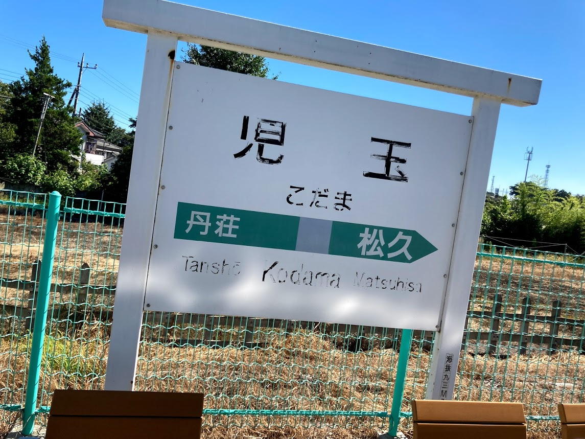
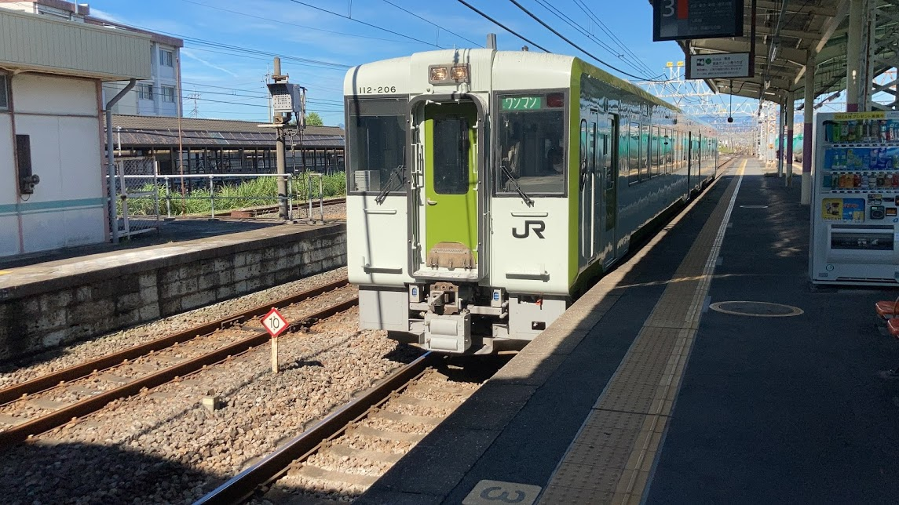

  
  

    <a href="https://www.mobilefactory.jp/newsrelease/2020/20200731/">www.mobilefactory.jp</a>
  

  

    
  

  

    
人気TVアニメ「ヤマノススメ」と「駅メモ！」が初コラボ！8月17日よりコラボキャンペーンを開催！ - 株式会社モバイルファクトリー

  

  

    
株式会社モバイルファクトリー（本社：東京都品川区、代表取締役：宮嶌裕二）は、配信中の位置情報連動型ゲーム「ステーションメモリーズ！」（略称：駅メモ！）において、TVアニメ「ヤマノススメ」とのコラボキャンペーンを2020年8月17日(月)より開催します。 「ヤマノススメ×駅メモ！」コラボキャンペーン概要

  

好きな作品なので巡ってきた。

  
  

    <a href="https://ekimemo.com/festa/yamanosusume_1">ekimemo.com</a>
  

  

    
  

  

    
「でんこと一緒にヤマノススメゆかりの地を巡ろう！」 | 駅メモ！ - ステーションメモリーズ！- 公式サイト

  

  

    
「でんこと一緒にヤマノススメゆかりの地を巡ろう！」

  

いくつか無理やりな点があるので反面教師として読んでもらえるといいかな。

## 起床

寝てない。
長旅になるのでいろいろ準備していると電車にギリギリ間に合うかどうかの時間に家を出てしまった。
青春18きっぷに印を押してもらっているうちに目当ての電車は出発してしまったナンテコッタイ。

## 八高線

都心から離れるほど電車の本数は減るので時間潰しのために八高線で児玉駅まで行った。

何もなかったのですぐに折り返し乗車して寄り道終了。

## 高崎駅

  

    
  

高崎駅にあるフードコートで早めの昼食。

  

    
  

上越線の待ち時間が結構あるのでゆっくり食べてました。

## 土合駅

  

    
  

土合駅名物の階段。

<blockquote class="twitter-tweet tw-align-center">
I&#39;m at 土合駅 in みなかみ町, 群馬県 <a href="https://t.co/CEgVVOM1Sr">https://t.co/CEgVVOM1Sr</a> <a href="https://t.co/2y0TmuvAN8">pic.twitter.com/2y0TmuvAN8</a>
&mdash; まきえたん (@makietanX) <a href="https://twitter.com/makietanX/status/1301715015695822853?ref_src=twsrc%5Etfw">September 4, 2020</a></blockquote> 

ヒィヒィ言いながら登りました。

**486段**。

  

    
  

その後、なんともいえない幻想的な通路を通り無人改札へ。

  

    
  

電車に乗り遅れず、天気がよかったら谷川岳ロープウェイに乗ろうと思っていたのだけど雨天だったので断念した。
谷川岳で昼食を食べたかったな無念。

  

    
  

駅茶ができてました。

紅茶も珈琲もジュースも飲めないので入りませんでしたが、面白そうなジュースがある感じでした。

帰りは地上駅。

  

    
  

  

    
  

## 水上駅

  

    
  

乗り換えに時間があったので外に出てどら焼き屋へ。

  

    
  

  

    
  

マンゴーと栗を購入。

フワッフワでおいしかった。

あとはSLと転車台。

  

    
  

  

    
  

## 伊香保温泉

  

    
  

電車では行けないので、関越バスの**伊香保線　1日フリー乗車券（大人800円　小人400円）**を購入した。
バス車内またはスマートフォンアプリ「バスもり！」で購入できる。
クレジットカード決済なのでKyashを紐付けたらおいしいポイント還元もある。
あと、伊香保温泉露天風呂が割引になる（伊香保石段の湯は割引してくれなかった）。

バスに揺られつつ、見晴下（みはらしした）

ここで2つ目のミス。

  

    
  

  

    
  

新型コロナの影響で平日の営業をしていなかった。

ちなみに見晴下バス停の近くにカレーうどん屋さんがある。
それか水沢うどんがおいしいらしいのでそっちにバスで向かうのもいいかもしれない。

  

    
  

予定が狂って徒歩で石段まで行くことに。

どうやら石段じゃないところを登っていたようだ。
裏路地に入ると射的屋の残骸みたいなのがたくさんあった。
射的で生きていけるのか...。
そういう心配になりながらもリア充がたくさんいる石段へ。

  

    
  

頭文字Dのマンホールがとてもシュールでした。

  

    
  

なんやかんや登りきった。

**365段**。

土合駅と同じ日に登ったからもう足パンパン。

  

    
  

神社の裏手に露天風呂への案内があった。

  

    
  

とてもわかりづらい...。

歩いてるといい感じの橋や温泉成分によって黄土色になった川などがあった。

  

    
  

  

    
  

伊香保温泉飲泉所へ。

いやー飲めない...。

まさしく鉄の味・血の味。

  

    
  

水のほうがおいしい（率直な感想）。

伊香保温泉露天風呂へ。

  

    
  

バスタオルは買い切り。

ぐんまちゃんの絵が描いてあった。

風呂は**温泉と水のみ**。

出るときに体を洗い流したり、洗髪をするには厳しい。

入ってると雨が降ってきた。

なかなかにタイミングが悪いこと。

休憩スペースにはヤマノススメのポスターがあった。

  

    
  

やっとヤマノススメ要素を確認できた。

最高だぜ伊香保温泉露天風呂。

伊香保温泉から石段へ戻る途中にイガグリのようなもの落ちていた。

踏むと転びそうになるので注意が必要だ。

  

    
  

そして石段の一番下へ。

  

    
  

汗がひどかったので着替えと洗髪を目的に石段の湯に行った。

  

    
  

関越バスの10%割引無視やロッカーがカゴで貴重品用ロッカーが有料100円だったことなど
いろいろ積み重なるとアレな部分もあるが入りやすい風呂でした。
まぁ無知なのと電車に乗り遅れた自分が悪い。

温泉に行くならこの前行った高尾山のところでいいや感も芽生えている。
ヤマノススメコラボで高尾山に行った話は後日書く。

伊香保温泉へ平日に行っても玉こんにゃくとかも売ってなかったりするので休日に行くことをおすすめしたい。

## 渋川駅

  

    
  

謎のおつまみが売っていたので購入。
変わった味がした。
歯ごたえは好き。

## ロックハート城

ここからはクズみたいなノルマの達成の仕方なので真似しないでいただきたい。
時間帯から察して欲しい。

  

    
  

乗りたかった電車に乗り遅れた結果、営業時間外に行くことに。

  

    
  

街灯１つないので非常に危険でした。

  

    
  

なので、バス内でチェックインして別のところで乗り換えるといいと思います。
ちなみに徒歩で行くのは不可能だと思ったほうがいいです。
バンバン車が走っていて危険ですわ。
片道590円しますが安全性を考えれば安いものです。

一番遅い時間帯をどうしても利用したいなら620円払って中山本宿まで行くほうがいいでしょう。
10分以内に出発するので。

## 新前橋駅

  

    
  

ポイントが溜まっていたのでグリーン車に乗車。
乗車時間的にも帰りはグリーン車が正解だと思う。

  

    
  

自宅から持ってきた**羽衣あられ**（ブルボン）とNewDaysで買ったおつまみとお茶で時間を潰しながら帰宅。

  

    
  

