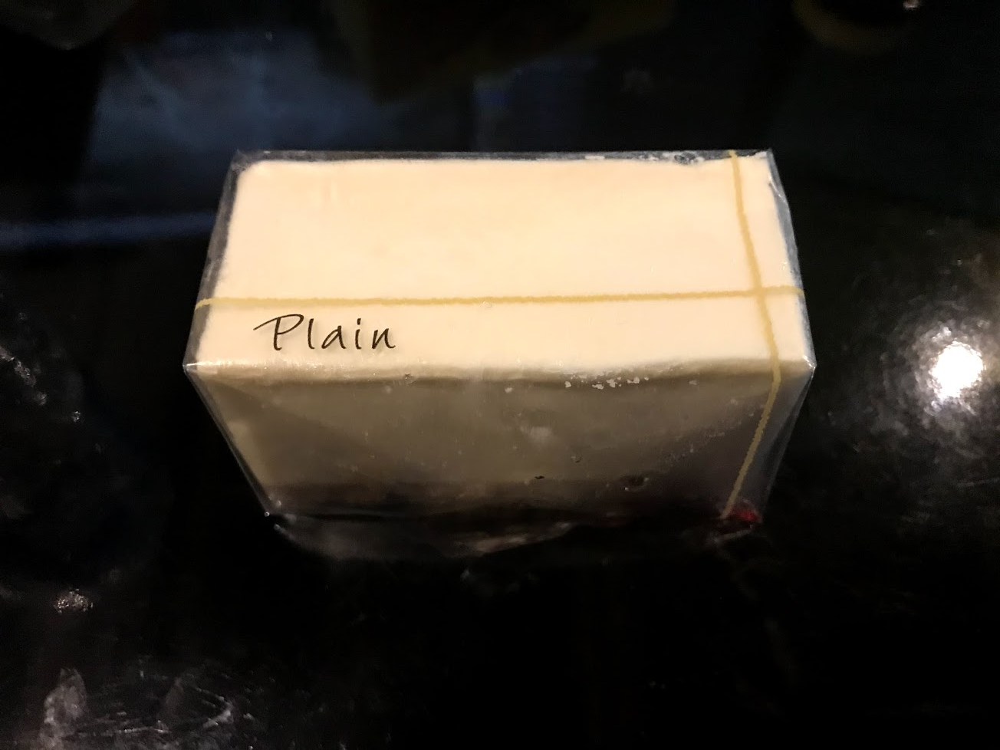

[embed:http://ochifuru-anime.com/news.html#n074]

## 燻薫〜kunkun〜

前回のイベントのときのブロッコリークラッカーが美味しかったので来店。

いやー推しを飾ってくれるとか最高。

<blockquote class="twitter-tweet">
むさことひがこ飲み比べてる with へもちゃん <a href="https://t.co/9Fe91gnUsW">pic.twitter.com/9Fe91gnUsW</a>
&mdash; まきえたん🥦 (@makietanX) <a href="https://twitter.com/makietanX/status/1373135728796782593?ref_src=twsrc%5Etfw">March 20, 2021</a></blockquote> 

空きっ腹に酒はガンガンに酔うので最終的に気分が高揚しとりました。
燻製には純米の方が合ってたかな？確か（記憶が曖昧）

<blockquote class="twitter-tweet">
🥦 <a href="https://t.co/wEHxC8StXo">pic.twitter.com/wEHxC8StXo</a>
&mdash; まきえたん🥦 (@makietanX) <a href="https://twitter.com/makietanX/status/1373135939476725761?ref_src=twsrc%5Etfw">March 20, 2021</a></blockquote> 

## 神カレー計画

今回のメインはこれ。
時間の都合上、前回来たときに参加できなかったので再訪した。

### スポットを巡る

まぁ察してくれ。答えは書けないんでね。

セブンイレブンのところがすげー難しかったかな個人的に（存在しないものを出されるとね...）。

<blockquote class="twitter-tweet">
酒の勢いで再度グッズ購入 (@ ひがこ日和 in 小金井市, 東京都) <a href="https://t.co/myWZDqCUHj">https://t.co/myWZDqCUHj</a> <a href="https://t.co/qADVkzVzfH">pic.twitter.com/qADVkzVzfH</a>
&mdash; まきえたん🥦 (@makietanX) <a href="https://twitter.com/makietanX/status/1373141306541760518?ref_src=twsrc%5Etfw">March 20, 2021</a></blockquote> 

<blockquote class="twitter-tweet">
へもちゃんとこでなんか買ってしまうよね（ちょろい） (@ 大洋堂書店 緑町店 in 小金井市, 東京都) <a href="https://t.co/tpnMppvLlE">https://t.co/tpnMppvLlE</a> <a href="https://t.co/lR8gt0w5wd">pic.twitter.com/lR8gt0w5wd</a>
&mdash; まきえたん🥦 (@makietanX) <a href="https://twitter.com/makietanX/status/1373151398142021633?ref_src=twsrc%5Etfw">March 20, 2021</a></blockquote> 

<blockquote class="twitter-tweet">
<a href="https://t.co/93mOG8Vl0M">pic.twitter.com/93mOG8Vl0M</a>
&mdash; まきえたん🥦 (@makietanX) <a href="https://twitter.com/makietanX/status/1373156844038889473?ref_src=twsrc%5Etfw">March 20, 2021</a></blockquote> 

<blockquote class="twitter-tweet">
I&#39;m at Wild Cherry Blossom in 小金井市, 東京都 <a href="https://t.co/WrF1OyaMYk">https://t.co/WrF1OyaMYk</a>  おちフル見れるいいところだ <a href="https://t.co/aTR4i5O6Jm">pic.twitter.com/aTR4i5O6Jm</a>
&mdash; まきえたん🥦 (@makietanX) <a href="https://twitter.com/makietanX/status/1373161052649623554?ref_src=twsrc%5Etfw">March 20, 2021</a></blockquote> 

色々買わせていただきました。

チョロいオタクなのでまた何かあったら行きたいと思います。

## コガネイチーズケーキ

イベントに直接関係ない店もおちフルに関係があればできる限り訪問するのだ。

<blockquote class="twitter-tweet">
プレーンとホワイトベリー (@ コガネイチーズケーキ in 小金井市) <a href="https://t.co/pQP7DNb6Tk">https://t.co/pQP7DNb6Tk</a> <a href="https://t.co/yYcjDKAPeE">pic.twitter.com/yYcjDKAPeE</a>
&mdash; まきえたん🥦 (@makietanX) <a href="https://twitter.com/makietanX/status/1373175784723116036?ref_src=twsrc%5Etfw">March 20, 2021</a></blockquote> 

非常に美味しかった。

## フィールる

[embed:https://dic.nicovideo.jp/a/%E3%83%95%E3%82%A3%E3%83%BC%E3%83%AB%28%E9%81%8A%E6%88%AF%E7%8E%8B5d%27s%29]

フィールといえば、**漫画「遊☆戯☆王5D's」に登場するなにか**であることは常識でしょう。

しかし、今回はアニメ制作会社を見に行った。

<blockquote class="twitter-tweet">
建物前 (@ 有限会社フィール in 小金井市, 東京都) <a href="https://t.co/RL835XtmTR">https://t.co/RL835XtmTR</a> <a href="https://t.co/9owbe9De3s">pic.twitter.com/9owbe9De3s</a>
&mdash; まきえたん🥦 (@makietanX) <a href="https://twitter.com/makietanX/status/1373178365591613441?ref_src=twsrc%5Etfw">March 20, 2021</a></blockquote> 

おちこぼれフルーツタルトだけでなく、やはり俺の青春ラブコメはまちがっている。続・完も手掛けている。
かなり前の作品になるが、まよチキ！はオススメ。

## 六甲山

ヒガコ感謝祭！があった日、話題になってた六甲山のお好み焼き...ではなく焼きそば！

<u>二郎風！マシマシ焼きそば (1100)</u>

<blockquote class="twitter-tweet">
汁なし二郎に近い 美味い ポストカードも貰えた 次はお好み焼きを食べに来たい <a href="https://t.co/aYMcTdPoBT">pic.twitter.com/aYMcTdPoBT</a>
&mdash; まきえたん🥦 (@makietanX) <a href="https://twitter.com/makietanX/status/1373186470299590658?ref_src=twsrc%5Etfw">March 20, 2021</a></blockquote> 

二郎風って二郎を舐めてもらったら困るよと思いながら一口入れた瞬間。
おっ二郎風は間違ってねえわという感想が脳内に浮かんだ。
非常に美味しかったです。
二郎オタクマウント完敗ですわ。

### おわりに

<blockquote class="twitter-tweet">
コンプ！ (@ ひがこ日和 in 小金井市, 東京都) <a href="https://t.co/1q7J8ABbE0">https://t.co/1q7J8ABbE0</a> <a href="https://t.co/IcFRcSuZ8L">pic.twitter.com/IcFRcSuZ8L</a>
&mdash; まきえたん🥦 (@makietanX) <a href="https://twitter.com/makietanX/status/1373172703730016262?ref_src=twsrc%5Etfw">March 20, 2021</a></blockquote> 

無事コンプしました。

<blockquote class="twitter-tweet">
おちフルの神カレー巡回してるけどPayPay使える店多くていいですね
&mdash; まきえたん🥦 (@makietanX) <a href="https://twitter.com/makietanX/status/1373157772125036545?ref_src=twsrc%5Etfw">March 20, 2021</a></blockquote> 

あとPayPay対応店も多く、散財しやすかったです。

<blockquote class="twitter-tweet">
帰るぞい楽しかった (@ 東小金井駅 in 小金井市, 東京都) <a href="https://t.co/DzwoXrXHse">https://t.co/DzwoXrXHse</a> <a href="https://t.co/d7YtKhK9pI">pic.twitter.com/d7YtKhK9pI</a>
&mdash; まきえたん🥦 (@makietanX) <a href="https://twitter.com/makietanX/status/1373187191640326145?ref_src=twsrc%5Etfw">March 20, 2021</a></blockquote> 

また行きたいね。

