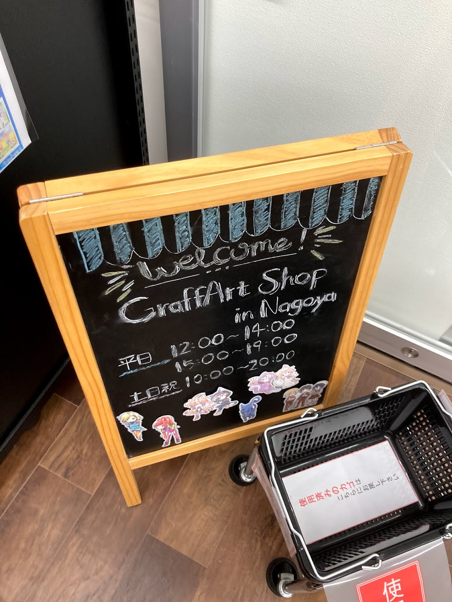
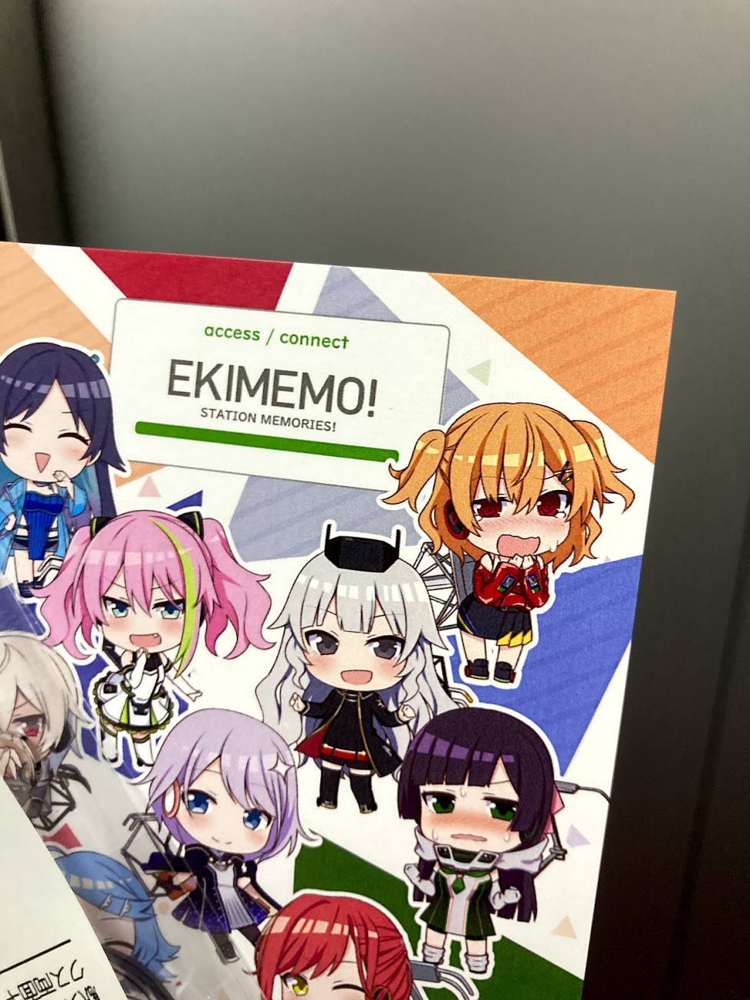
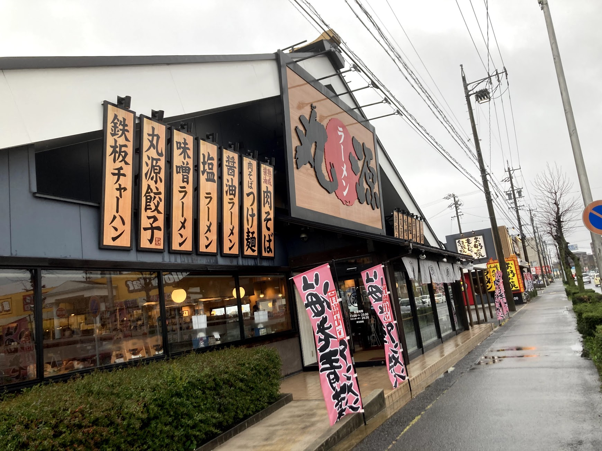

2021年青春18切符の旅。

東京-名古屋日帰り編。

今回の旅の目的は複数ある。

1. 弁天島のゆるキャン△コラボを見る
2. 駅メモのグッズを名古屋で買う（GraffArt SHOP）
3. 名古屋で何か食べる
4. 丸源ラーメンを食べる
5. ゆるキャン△ラッピングをしている天浜線に乗る

## 0. ゆるキャン△ 第11話を見る

<blockquote class="twitter-tweet tw-align-center">
第11話 <a href="https://twitter.com/ABEMA?ref_src=twsrc%5Etfw">@ABEMA</a> で無料配信中 <a href="https://t.co/fc0toz04DH">https://t.co/fc0toz04DH</a>   ループしてると無限に時間が溶けていく
&mdash; まきえたん🥦 (@makietanX) <a href="https://twitter.com/makietanX/status/1373229945116233730?ref_src=twsrc%5Etfw">March 20, 2021</a></blockquote> 

最高にハイってやつだ

## 1. 弁天島のゆるキャン△コラボを見る

<blockquote class="twitter-tweet tw-align-center">
弁天島のゆるキャンのやつ 今日は行くべきではないね 暴風と豪雨がヤバすぎてまず近づけない 駅のホームから微かに見えるのを楽しむべし <a href="https://t.co/j00YUHhZmt">pic.twitter.com/j00YUHhZmt</a>
&mdash; まきえたん🥦 (@makietanX) <a href="https://twitter.com/makietanX/status/1373461759139323904?ref_src=twsrc%5Etfw">March 21, 2021</a></blockquote> 

天候が悪いから覚悟してたよ。

傘がね反対になったよ。
もうボロボロ。

<blockquote class="twitter-tweet tw-align-center">
駅から波の様子撮ってたら貨物がぶっこんできた <a href="https://t.co/zwYYWiY1i5">pic.twitter.com/zwYYWiY1i5</a>
&mdash; まきえたん🥦 (@makietanX) <a href="https://twitter.com/makietanX/status/1373463488056598529?ref_src=twsrc%5Etfw">March 21, 2021</a></blockquote> 

てかね、ホームにいても濡れるんだよ。

どんな風吹いてんだってね。

## 2. 駅メモのグッズを名古屋で買う（GraffArt SHOP）

開いてました。よかった。

ポストカードをゲットして帰宅だ。

## 3. 名古屋で何か食べる

<blockquote class="twitter-tweet tw-align-center">
スガキヤ <a href="https://t.co/GKbpwOhlev">pic.twitter.com/GKbpwOhlev</a>
&mdash; まきえたん🥦 (@makietanX) <a href="https://twitter.com/makietanX/status/1373497264732213249?ref_src=twsrc%5Etfw">March 21, 2021</a></blockquote> 

あんまり時間なかったけどスガキヤに行けた。

## 4. 丸源ラーメンを食べる

<blockquote class="twitter-tweet tw-align-center">
電車内に傘忘れた…最悪
&mdash; まきえたん🥦 (@makietanX) <a href="https://twitter.com/makietanX/status/1373503583514075140?ref_src=twsrc%5Etfw">March 21, 2021</a></blockquote> 

丸源ラーメンが近くにある駅へ着く前に気づいた。
そしてその駅は何もなかった。

なので、丸源ラーメンへびしょぬれで行った。
申し訳ないと思ったけど駅から濡れずに行けないのも悪い。

タクシーも見当たらないからほんと最低な駅だった。
二度と降りないからこんなところ。

無限の文句を言いつつも到着。

  

    
  

<u>からあげ餃子セット (1023) + ねぎ肉そば (+143)</u>

ねぎ肉そばを注文。

あーこれだよ。これを食べるためにきた。

雨には勝てなかったよ状態になりながらもね。

## 5. ゆるキャン△ラッピングをしている天浜線に乗る

  
  

    <a href="https://hamamatsu.keizai.biz/headline/2694/">hamamatsu.keizai.biz</a>
  

  

    
  

  

    
天竜浜名湖鉄道にアニメ「ゆるキャン△」とコラボしたラッピング列車 - 浜松経済新聞

  

  

    
天竜浜名湖鉄道（浜松市天竜区二俣町、TEL 053-925-2276）が2月12日、アニメ「ゆるキャン△」とコラボしたフルラッピング列車の運行を始めた。

  

奇跡的にゆるキャン△ラッピングの車両に乗ることができた。
スケジュールが公開されていなかったのでヒヤヒヤした。

<blockquote class="twitter-tweet tw-align-center">
やった！ゆるキャンラッピングだぜ！ (@ 天浜線 新所原駅 in 湖西市, 静岡県) <a href="https://t.co/rEny830NuR">https://t.co/rEny830NuR</a> <a href="https://t.co/xLh6gWCBGN">pic.twitter.com/xLh6gWCBGN</a>
&mdash; まきえたん🥦 (@makietanX) <a href="https://twitter.com/makietanX/status/1373534432079011840?ref_src=twsrc%5Etfw">March 21, 2021</a></blockquote> 

外はセンターに斉藤さん。
あざといぜ！

<blockquote class="twitter-tweet tw-align-center" data-conversation="none">
車体のドセンターには斎藤さん <a href="https://t.co/bqbUBz8Tgo">pic.twitter.com/bqbUBz8Tgo</a>
&mdash; まきえたん🥦 (@makietanX) <a href="https://twitter.com/makietanX/status/1373535115129753604?ref_src=twsrc%5Etfw">March 21, 2021</a></blockquote> 

乗車すると中はゆるキャン△一色だった。

<blockquote class="twitter-tweet tw-align-center" data-conversation="none">
隣の斉藤さん <a href="https://t.co/cq0xtu84x1">pic.twitter.com/cq0xtu84x1</a>
&mdash; まきえたん🥦 (@makietanX) <a href="https://twitter.com/makietanX/status/1373544624745115649?ref_src=twsrc%5Etfw">March 21, 2021</a></blockquote> 

さて、斉藤さんの隣に乗るか。

あーいいっすわ。
あの自由人なところがいいんだよね斉藤さん。

知らないうちに発売されて既に買えないねんどろいどの再販を希望したい。

肝心の車窓風景は雨天だったので楽しめず…また機会があれば行きたい。

  

    
  

  

    
  

ちゃんと地元嫁こと土岐綾乃もいる。

<blockquote class="twitter-tweet tw-align-center">
濁流すわ <a href="https://t.co/fvzGuFbmUL">pic.twitter.com/fvzGuFbmUL</a>
&mdash; まきえたん🥦 (@makietanX) <a href="https://twitter.com/makietanX/status/1373540832930717696?ref_src=twsrc%5Etfw">March 21, 2021</a></blockquote> 

終点で下車。

<blockquote class="twitter-tweet tw-align-center">
反対側なんとか撮影した 時間ギリギリだ <a href="https://t.co/4VAjNpGQnS">pic.twitter.com/4VAjNpGQnS</a>
&mdash; まきえたん🥦 (@makietanX) <a href="https://twitter.com/makietanX/status/1373568727828992001?ref_src=twsrc%5Etfw">March 21, 2021</a></blockquote> 

反対側を見るチャンスがなかったので帰りに慌ててJRの改札に入って撮影した。
予定していた電車に乗り遅れなかったのが助かったよ。

<blockquote class="twitter-tweet tw-align-center">
コンプ <a href="https://t.co/BY0hINdTPT">pic.twitter.com/BY0hINdTPT</a>
&mdash; まきえたん🥦 (@makietanX) <a href="https://twitter.com/makietanX/status/1373564009559904256?ref_src=twsrc%5Etfw">March 21, 2021</a></blockquote> 

もちろん駅メモはコンプした。

## 帰り

熱海駅からはグリーン車で帰宅。
いやー楽だわグリーン車は。
JRE POINTはチャージじゃなくてグリーン車利用一択だね。

## おわりに

一番の出費は傘。
多分ラーメンより高かった。

次は雨の降ってない日に行きたいね。
