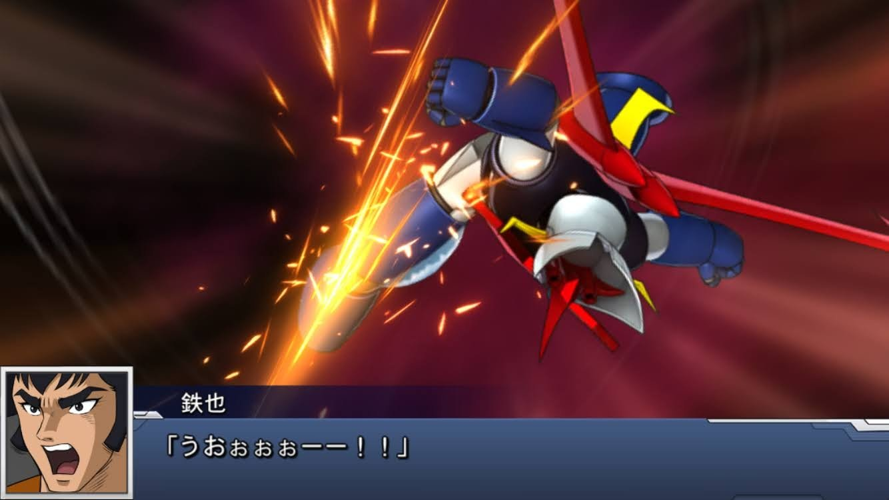

<blockquote class="twitter-tweet tw-align-center">
異なるOS間での有償石を引き継ぐことはApple/Googleの規約でダメって書いてるから承知しとったが、戻ったときに有償石/無償石ともに完全消滅するアプリに出会ってこなかったせいか結構萎えてる 「元のOSに戻ってきても消えてる」ことがわかるように説明書いてくれや <a href="https://twitter.com/hashtag/%E3%82%B9%E3%83%91%E3%83%AD%E3%83%9CDD?src=hash&amp;ref_src=twsrc%5Etfw">#スパロボDD</a> <a href="https://t.co/B6AOmTdPUU">pic.twitter.com/B6AOmTdPUU</a>
&mdash; まきえたん🥦 (@makietanX) <a href="https://twitter.com/makietanX/status/1385665340017762324?ref_src=twsrc%5Etfw">April 23, 2021</a></blockquote> 

一切残ってなかった。
最近のソシャゲでは珍しいくらいの対応だ。

OSをまたいだ移動をして、また元のOSに戻ってきたときに石が残っているのが任天堂をはじめとする良心的なゲーム会社だ。

バンダイナムコゲームスに期待してはいけないようだ。
せっかく課金したのに悲しい結末になった。

iOSでは課金しないと決めている。
いつもはiPhone6Sでプレイしていたので課金することはなかった。
たまたま、Androidで課金をする予定があったので移動して課金してアイテム購入して戻ってきたら石が0になっていた。
他のソシャゲのように残っているものだと思っていたがそうではなかったようだ。

完全消滅。

完全にバンダイナムコゲームスに食われた形となった。

泣いたわマジで。

無料・有料の概念がないから勘違いしてしまったのだ。
他のソシャゲはそこを区分していて駅メモならメロンを購入する形式となる。
そこからアイテムを購入するので基本的に有料メロンしか存在しない。
スパロボDDは違った。
混ざってる。

ややこしいんだよ。

