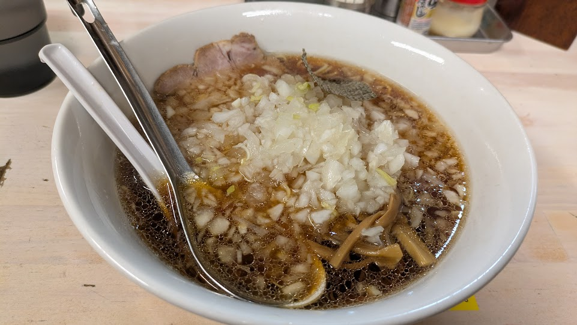
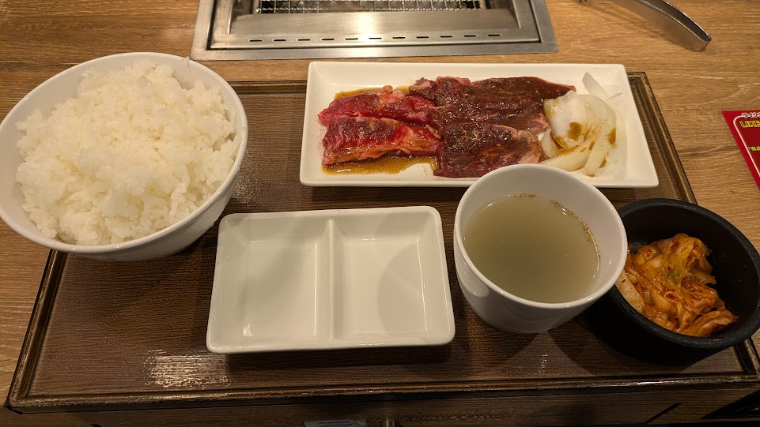

## 高尾駅へ

JRの青春18きっぷを使って高尾駅へ行ってきた。
高尾駅は、JR中央線と京王線が乗り入れる駅で、東京都八王子市に位置している。

今回の目的は、八王子エリアで配布されている「桑都・八王子聖地巡礼マップ」を入手することだ。
これは京王電鉄の構内で配布されているので、入場券を購入して駅構内に入る必要がある。
入場券は140円で購入できる。
ただ、どうやって買えばよかったのかちょっとわからなかったので140円券を買って改札に入った。
改札を入ると、すぐに「桑都・八王子聖地巡礼マップ」が置いてあったので、無事に入手できた。
等身大パネルもすぐ近くに設置されていた。

## 桑都・八王子聖地巡礼マップ

八王子エリアで配布されている「桑都・八王子聖地巡礼マップ」を入手した。

表紙は「日々は過ぎれど飯うまし」になっている。

  
  

    <a href="https://japan-heritage.bunka.go.jp/ja/news/5788/">japan-heritage.bunka.go.jp</a>
  

  

    
  

  

    
アニメ『日々は過ぎれど飯うまし』、日本遺産のまち「桑都・八王子聖地巡礼マップ」の配布などを開始します！｜日本遺産ポータルサイト

  

  

    
日本遺産（Japan Heritage）ポータルサイトのアニメ『日々は過ぎれど飯うまし』、日本遺産のまち「桑都・八王子聖地巡礼マップ」の配布などを開始します！についてのページです。八王子が舞台のアニメ『日々は過ぎれど飯うまし』に登場したスポ

  

> アニメでは、高尾山をはじめとした日本遺産「桑都物語」に関連するスポットが多数登場しているため、今回の企画が実現しました。

アニメに登場したスポットと、日本遺産「桑都物語」に関連する場所をあわせて巡れる内容になっているらしい。

配布だけでなく、等身大パネルの設置も実施されている。

  
  

    <a href="https://japan-heritage-soto.jp/2026/03/02/%E3%80%903%E6%9C%884%E6%97%A5%EF%BD%9E%E3%80%91%E3%80%8C%E6%A1%91%E9%83%BD%E3%83%BB%E5%85%AB%E7%8E%8B%E5%AD%90%E8%81%96%E5%9C%B0%E5%B7%A1%E7%A4%BC%E3%83%9E%E3%83%83%E3%83%97%E3%80%8D%E3%81%AE%E9%85%8D/">japan-heritage-soto.jp</a>
  

  

    
  

  

    
【3月4日～】「桑都・八王子聖地巡礼マップ」の配布などを開始します！ | 桑都物語公式ポータルサイト 日本遺産八王子 霊気満山 高尾山 ～人々の祈りが紡ぐ桑都物語～

  

  

    
日本遺産に登録された八王子の魅力を紹介する公式ウェブサイト。日本遺産 霊気満山 高尾山 ～人々の祈りが紡ぐ桑都物語～ 織物のまち「桑都（そうと）」と呼ばれる八王子。その物語は高尾山への信仰とともに豊かな文化を未来へと紡いでいます。

  

## 配布場所

聖地巡礼マップは、八王子市内の観光案内所や駅などで配布されている。

- 高尾山口駅、高尾駅、南大沢駅（京王線）

  

    
  

## 等身大パネル

確認できた設置スケジュールは以下の通り。

- 高尾駅（京王線） 4月1日（水）～4月19日（日）

八王子方面へ出かける予定があるなら、配布場所や設置期間を見つつ回るとちょうどよさそうだ。

ひびめしで一番好きだわつつじちゃん。

めっちゃ小さい。

好き。

いやー、いいですね。

このドヤ顔、最高です。

## 女！ラーメン！焼肉！

ひびめしとは全然関係ないけど、せっかく高尾駅に来たので、駅近くの店でラーメンを食べてきた。

高尾駅近くの店に行って薬味（玉ねぎ）ラーメン 900円を食べた。
玉ねぎがたっぷり入っていて、面白いラーメンだった。
血液サラサラになりそうな感じがする（ならない）。

あと、浜松町の焼肉ライクにも行った。

これは1日5000歩の目標を達成するために浜松町で降りたが、ちょうど焼肉ライクがあったので入ったという感じ。

ライクカルビ&ハラミセットS 1,490円を食べた。
やっぱSだとちょっと物足りないなあと思う。
でも、ラーメン食べてるので満足。

## おわりに

浜松町を歩いていると道に迷った外人に「デーモンステーションはどこですか？（英訳：Where is the Demon Station?）」と聞かれた。
悪魔の駅ってなんだよと思いながらも、すぐに大門駅のことだとわかったので「大門駅はこっちの方です（英訳：Daimon Station is this way）」と教えてあげた。「Oh, thank you!」と言われたので、無事にコミュニケーションが取れてよかった。いやー毎回思うけど、英語が話せるようになりたいなあと思う。

高尾駅で「桑都・八王子聖地巡礼マップ」を入手してきた。
表紙は「日々は過ぎれど飯うまし」になっていて、アニメに登場したスポットと日本遺産「桑都物語」に関連する場所をあわせて巡れる内容になっているらしい。
配布場所や設置期間を見つつ回るとちょうどよさそうだ。
